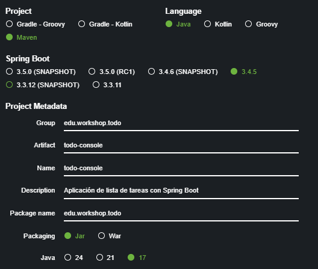

# Taller de Maven y Spring Boot

## Descripción
Este taller te introducirá a Maven y Spring Boot a través de la creación de una aplicación de lista de tareas (Todo List) desde cero. Aprenderás a estructurar un proyecto utilizando buenas prácticas de Git Flow.

## Prerrequisitos
- Java 17+ instalado
- Maven 3.9+ instalado
- Git instalado

## Parte 1: Creación de una aplicación de consola con Maven

### 1. Crea un proyecto Maven desde consola

```bash
mvn archetype:generate -DgroupId=edu.workshop.todo -DartifactId=todo-console -DarchetypeArtifactId=maven-archetype-quickstart -DarchetypeVersion=1.4 -DinteractiveMode=false -Dpackage=edu.workshop.todo
```

### 2. Configura el proyecto

Edita el archivo pom.xml para añadir la configuración de Java:

```xml
```xml
<properties>
    <project.build.sourceEncoding>UTF-8</project.build.sourceEncoding>
    <maven.compiler.source>17</maven.compiler.source>
    <maven.compiler.target>17</maven.compiler.target>
</properties>
```

Añade la configuración para ejecutar la aplicación:

```xml
<build>
    <plugins>
        <plugin>
            <groupId>org.codehaus.mojo</groupId>
            <artifactId>exec-maven-plugin</artifactId>
            <version>3.1.0</version>
            <configuration>
                <mainClass>edu.workshop.todo.App</mainClass>
            </configuration>
        </plugin>
    </plugins>
</build>
```

## Crear proyecto con spring boot initializer
# Configuración del Proyecto Spring Boot

## Datos Básicos
- **Group:** `edu.workshop.todo`
- **Artifact:** `todo-console`
- **Name:** Igual que el Artifact
- **Description:** "Aplicación de lista de tareas con Spring Boot"
- **Package name:** `edu.workshop.todo`
- **Packaging:** Jar



---
### 3. Crea las clases básicas

Crea una clase `Task.java` en `src/main/java/edu/workshop/todo`:


```java
package edu.workshop.todo;

public class Task {
    private int id;
    private String description;
    private boolean completed;

    public Task(int id, String description) {
        this.id = id;
        this.description = description;
        this.completed = false;
    }

    // Getters y setters
    public int getId() { return id; }
    
    public String getDescription() { return description; }
    public void setDescription(String description) { this.description = description; }
    
    public boolean isCompleted() { return completed; }
    public void setCompleted(boolean completed) { this.completed = completed; }
    
    @Override
    public String toString() {
        return id + ". [" + (completed ? "✓" : " ") + "] " + description;
    }
}
```

Crea una clase `TodoManager.java` en `src/main/java/edu/workshop/todo`:

```java
package edu.workshop.todo;

import org.springframework.stereotype.Component;
import java.util.ArrayList;
import java.util.List;

@Component
public class TodoManager {
    private List<Task> tasks = new ArrayList<>();
    private int nextId = 1;

    public Task addTask(String description) {
        Task task = new Task(nextId++, description);
        tasks.add(task);
        return task;
    }

    public List<Task> getAllTasks() {
        return new ArrayList<>(tasks);
    }

    public Task getTaskById(int id) {
        return tasks.stream()
                .filter(task -> task.getId() == id)
                .findFirst()
                .orElse(null);
    }

    public boolean completeTask(int id) {
        Task task = getTaskById(id);
        if (task != null) {
            task.setCompleted(true);
            return true;
        }
        return false;
    }

    public boolean deleteTask(int id) {
        return tasks.removeIf(task -> task.getId() == id);
    }
}
```

### 4. Actualiza la clase principal TodoConsoleApplication.java

```java
package edu.workshop.todo;

import java.util.Scanner;

import org.springframework.boot.CommandLineRunner;
import org.springframework.boot.SpringApplication;
import org.springframework.boot.autoconfigure.SpringBootApplication;
import org.springframework.context.annotation.Bean;

@SpringBootApplication
public class TodoConsoleApplication {

    public static void main(String[] args) {
        SpringApplication.run(TodoConsoleApplication.class, args);
    }
    
    @Bean
    public CommandLineRunner commandLineRunner(TodoManager todoManager) {
        return args -> {
            Scanner scanner = new Scanner(System.in);
            
            System.out.println("==================================");
            System.out.println("💻 CONSOLA DE TAREAS PENDIENTES 💻");
            System.out.println("==================================");
            
            // Añadir algunas tareas de ejemplo
            todoManager.addTask("Aprender Maven");
            todoManager.addTask("Estudiar Spring Boot");
            todoManager.addTask("Implementar Git Flow");
            
            boolean exit = false;
            while (!exit) {
                showMenu();
                int option = getUserOption(scanner);
                
                switch (option) {
                    case 1:
                        listTasks(todoManager);
                        break;
                    case 2:
                        addTask(scanner, todoManager);
                        break;
                    case 3:
                        completeTask(scanner, todoManager);
                        break;
                    case 4:
                        deleteTask(scanner, todoManager);
                        break;
                    case 5:
                        exit = true;
                        break;
                    default:
                        System.out.println("⚠️ Opción inválida. Intente de nuevo.");
                }
            }
            
            System.out.println("¡Hasta pronto! 👋");
            scanner.close();
            // Para asegurar que la aplicación termine después de cerrar el menú
            System.exit(0);
        };
    }
    
private static void showMenu() {
    System.out.println("\n--- MENÚ PRINCIPAL ---");
    System.out.println("1. [L] Listar tareas");
    System.out.println("2. [+] Añadir tarea");
    System.out.println("3. [✓] Marcar tarea como completada");
    System.out.println("4. [X] Eliminar tarea");
    System.out.println("5. [S] Salir");
    System.out.print("Seleccione una opción: ");
}
    
    private static int getUserOption(Scanner scanner) {
    try {
        return Integer.parseInt(scanner.nextLine());
    } catch (NumberFormatException e) {
        return -1;
    }
}

private static void listTasks(TodoManager todoManager) {
    System.out.println("\n[L] LISTA DE TAREAS:");
    System.out.println("------------------");
    
    var tasks = todoManager.getAllTasks();
    if (tasks.isEmpty()) {
        System.out.println("No hay tareas pendientes. ¡Añade una nueva tarea!");
        return;
    }
    
    for (Task task : tasks) {
        System.out.println(task);
    }
}

private static void addTask(Scanner scanner, TodoManager todoManager) {
    System.out.print("\n[+] Ingrese descripción de la nueva tarea: ");
    String description = scanner.nextLine();
    
    if (description.trim().isEmpty()) {
        System.out.println("[!] La descripción no puede estar vacía.");
        return;
    }
    
    Task newTask = todoManager.addTask(description);
    System.out.println("[+] Tarea añadida: " + newTask);
}

private static void completeTask(Scanner scanner, TodoManager todoManager) {
    listTasks(todoManager);
    System.out.print("\n[✓] Ingrese ID de la tarea a completar: ");
    
    try {
        int id = Integer.parseInt(scanner.nextLine());
        if (todoManager.completeTask(id)) {
            System.out.println("[✓] ¡Tarea completada exitosamente!");
        } else {
            System.out.println("[!] Tarea no encontrada.");
        }
    } catch (NumberFormatException e) {
        System.out.println("[!] Por favor ingrese un número válido.");
    }
}

private static void deleteTask(Scanner scanner, TodoManager todoManager) {
    listTasks(todoManager);
    System.out.print("\n[X] Ingrese ID de la tarea a eliminar: ");
    
    try {
        int id = Integer.parseInt(scanner.nextLine());
        if (todoManager.deleteTask(id)) {
            System.out.println("[X] Tarea eliminada exitosamente.");
        } else {
            System.out.println("[!] Tarea no encontrada.");
        }
    } catch (NumberFormatException e) {
        System.out.println("[!] Por favor ingrese un número válido.");
    }
}
}
```

### 5. Compilar y ejecutar

```bash
cd todo-console
mvn clean package
mvn sprint-boot:run
```
